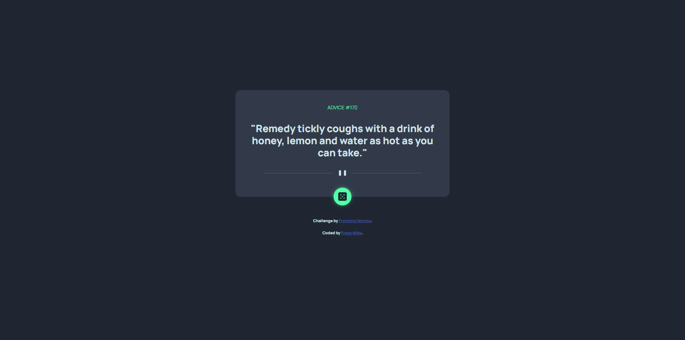

# The project title

## Table of contents

- [Overview](#overview)
  - [The challenge](#the-challenge)
  - [Screenshot](#screenshot)
  - [Links](#links)
- [My process](#my-process)
  - [Built with](#built-with)
  - [What I learned](#what-i-learned)
  - [Continued development](#continued-development)
- [Author](#author)

## Overview

### The project

The challenge is to build out a advice generator app using the [Advice Slip API](https://api.adviceslip.com) and get it looking as close to the design as possible.

The design

### Screenshot

My solution

### Links

- [Solution URL](https://github.com/mikeFrees/advice-generator-app-main)
- [Live Site URL](https://mikes-advice-generator.netlify.app/)

## My process

### Built with

- Semantic HTML5 markup
- CSS custom properties
- Flexbox
- Mobile-first workflow
- postcss autoprefixer and cssnano
- scss with 7 to 1 file structure
- fontsource

### What I learned

This was my first time using an API so i mainly learned how to use the fetch API and the advice generator API.
I also improved on my file structure and can now see the advantage of the 7 to 1 structure with scss.

### Continued development

I can still organize my files better and create a good pipeline to transform mu files instead of running every npm script on its own. And i should comment my code better and commit more often. I know that this is a small project but i want to get into the habit of being organized for when i tackle a big project.

## Author

- LinkedIn - [Frees Mike](https://www.linkedin.com/in/mike-frees/)
- Frontend Mentor Profile - [Mike Frees](https://www.frontendmentor.io/profile/mikeFrees)
